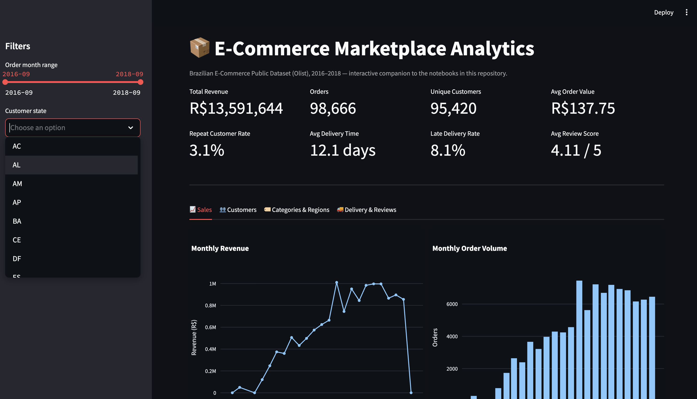
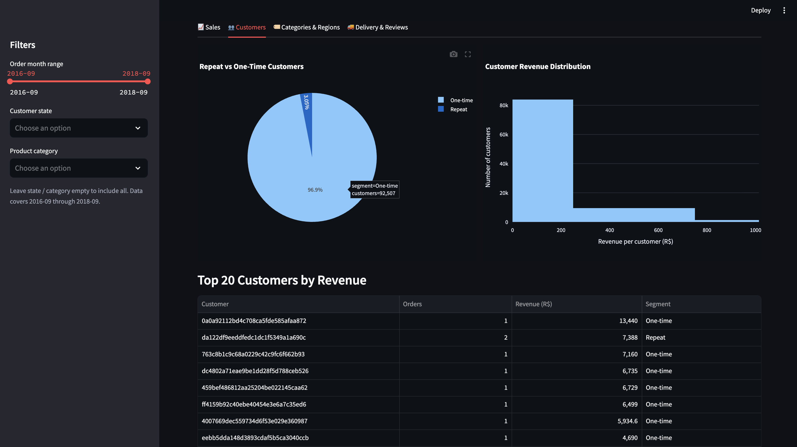
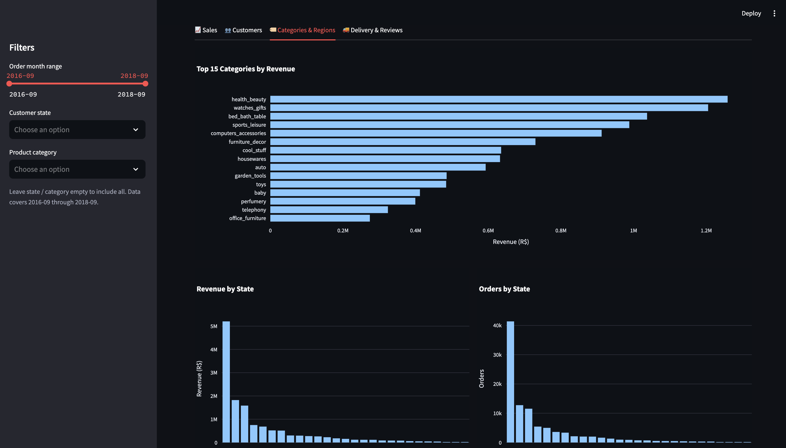
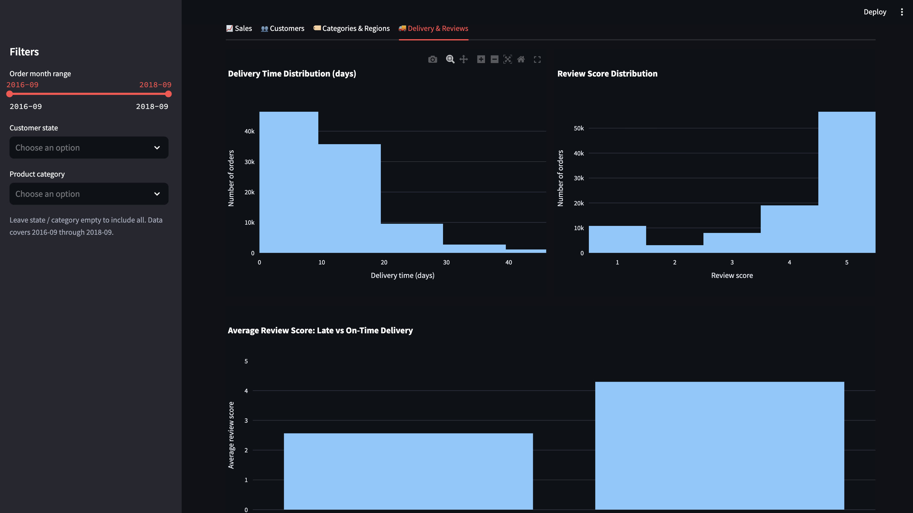

# 📊 E-Commerce Marketplace Analytics

[](https://www.python.org/)
[](https://www.sqlite.org/)
[](https://streamlit.io/)
[](LICENSE)

A junior data analytics portfolio project based on the **Brazilian E-Commerce Public Dataset by Olist**, covering the full analytics workflow — from raw CSV data to an interactive dashboard.

> 📌 Analyzes marketplace sales, customers, product categories, delivery performance, and customer reviews for a Brazilian e-commerce marketplace (2016–2018).

---

## 🖼️ Dashboard Preview

<p align="center">
  
</p>
<p align="center">
  
</p>
<p align="center">
  
</p>
<p align="center">
  
</p>
---

## 🎯 Project Overview

This project demonstrates a complete, beginner-friendly analytics workflow:

- Data cleaning and validation with **Python**
- Database creation with **SQLite**
- Business analysis with **SQL** (joins, CTEs, window functions)
- Exploratory data analysis (**EDA**)
- Data visualization
- Business insights and reporting
- Interactive dashboard development with **Streamlit**

---

## ❓ Business Questions

- How did revenue and order volume change over time?
- Which product categories generated the most revenue?
- Which Brazilian states had the highest number of customers and orders?
- How often were orders delivered late?
- Is delivery performance related to customer review scores?
- How many customers placed repeat orders?
- Which products and categories performed best?
- What customer and delivery patterns can be identified?

---

## 💡 Key Findings

- Revenue and order volume increased during the main observation period.
- A small number of product categories generated a significant share of total revenue.
- Most customers placed only one order.
- Delivery delays were associated with lower customer review scores.
- Customer activity was concentrated in a few Brazilian states.
- Customer purchasing behavior followed a classic **Pareto distribution** — a relatively small share of customers generated a large portion of revenue.

---

## 🧪 Sample SQL: Monthly Revenue with Running Total

A short example of the SQL used in the project (window functions + CTE):

```sql
WITH monthly_revenue AS (
    SELECT
        strftime('%Y-%m', o.order_purchase_timestamp) AS order_month,
        SUM(oi.price) AS revenue
    FROM orders o
    JOIN order_items oi ON o.order_id = oi.order_id
    WHERE o.order_status = 'delivered'
    GROUP BY order_month
)
SELECT
    order_month,
    revenue,
    SUM(revenue) OVER (ORDER BY order_month) AS running_total_revenue,
    RANK() OVER (ORDER BY revenue DESC) AS revenue_rank
FROM monthly_revenue
ORDER BY order_month;
```

More queries (joins, CASE WHEN, LAG, reusable views) are in [`sql/`](sql/).

---

## 🛠️ Tools and Technologies

| Category | Tools |
|---|---|
| Language | Python |
| Data processing | pandas, NumPy |
| Visualization | matplotlib, Plotly |
| Database | SQL, SQLite |
| Notebooks | Jupyter Notebook |
| Dashboard | Streamlit |
| Version control | Git, GitHub |

---

## 📂 Dataset

The project uses the **Brazilian E-Commerce Public Dataset by Olist**, containing anonymized marketplace orders placed in Brazil between 2016 and 2018.

Main tables used:

- orders
- order items
- customers
- products
- product category translations
- order reviews

> The original CSV files are not included in this repo due to size. Download them from Kaggle and place them in `data/raw/`.

A ready-to-use SQLite database is already included at `database/ecommerce.db`, so the dashboard runs without rebuilding anything.

---

## 📁 Project Structure

```
ecommerce-marketplace-analytics/
├── dashboard/
│   └── app.py
├── data/
│   ├── raw/
│   └── processed/
├── database/
│   └── ecommerce.db
├── notebooks/
│   ├── 01_data_cleaning.ipynb
│   ├── 02_sqlite_database_setup.ipynb
│   ├── 03_sql_analysis.ipynb
│   └── 04_python_eda.ipynb
├── reports/
│   ├── analysis_summary.md
│   ├── data_quality_report.md
│   ├── database_validation_report.md
│   ├── eda_report.md
│   └── sql_analysis_report.md
├── sql/
│   ├── 00_create_schema.sql
│   ├── 00_load_data.sql
│   ├── 00_validation.sql
│   ├── 01_business_queries.sql
│   ├── 02_window_functions.sql
│   ├── 03_cte_queries.sql
│   └── 04_views.sql
├── visuals/
├── README.md
├── requirements.txt
└── LICENSE
```

---

## 🔄 Analysis Workflow

1. Load and inspect the raw CSV files.
2. Clean missing values and duplicate records.
3. Convert date columns into the correct format.
4. Validate relationships between tables.
5. Save cleaned datasets.
6. Create a SQLite database.
7. Run SQL business queries.
8. Perform exploratory data analysis in Python.
9. Create and save visualizations.
10. Build an interactive Streamlit dashboard.
11. Summarize the main findings in reports.

---

## 🧮 SQL Skills Demonstrated

`SELECT` · `WHERE` · `GROUP BY` · `HAVING` · `ORDER BY` · inner & left joins · aggregations · `CASE WHEN` · common table expressions · window functions (`ROW_NUMBER`, `RANK`, `LAG`) · running totals · reusable SQL views

## 🐍 Python Skills Demonstrated

Loading CSVs with pandas · inspecting datasets · cleaning missing values · removing duplicates · working with date/time columns · merging DataFrames · grouping and aggregating · calculating business metrics · creating visualizations · exporting processed data and reports

---

## 🔍 Key Analysis Areas

**Sales** — monthly revenue, order volume, average order value, revenue trends
**Customers** — unique & repeat customers, revenue distribution, segmentation
**Products & Categories** — top categories/products by revenue, performance comparisons
**Geography** — revenue and orders by state, delivery time by state
**Delivery & Reviews** — delivery time distribution, late delivery rate, review scores vs. delivery outcome

---

## 📊 Interactive Dashboard

Located at `dashboard/app.py`, built on `database/ecommerce.db`.

**Filters:** month · customer state · product category

**Displays:** revenue · number of orders · average order value · unique customers · sales trends · customer analysis · category performance · regional performance · delivery metrics · review metrics

---

## 🚀 How to Run the Project

**1. Clone the repository**
```bash
git clone https://github.com/amangeldievaalinaa-cmd/ecommerce-marketplace-analytics.git
cd ecommerce-marketplace-analytics
```

**2. Create and activate a virtual environment**
```bash
python3 -m venv .venv
source .venv/bin/activate     # macOS/Linux
.venv\Scripts\activate        # Windows
```

**3. Install dependencies**
```bash
pip install -r requirements.txt
```

**4. Run the dashboard**

Since the prepared SQLite database is already included, you can start the dashboard directly:
```bash
streamlit run dashboard/app.py
```
It will open at `http://localhost:8501`.

> Python 3.11 or 3.12 is recommended for best package compatibility.

---

## 🔁 Run the Full Analytics Pipeline

To rebuild everything from the original CSV files:

1. Download the [Olist dataset](https://www.kaggle.com/datasets/olistbr/brazilian-ecommerce) and place it in `data/raw/`.
2. Start Jupyter: `jupyter notebook`
3. Run the notebooks in order:
   ```
   01_data_cleaning.ipynb
   02_sqlite_database_setup.ipynb
   03_sql_analysis.ipynb
   04_python_eda.ipynb
   ```

This regenerates the cleaned datasets, the SQLite database, SQL analysis results, visualizations, and reports.

---

## 📈 Visualizations

Charts covering monthly revenue/order trends, order value distribution, customer revenue distribution, repeat vs. one-time customers, revenue by category, top products, revenue/orders by state, delivery time, late delivery rate, and review scores — all stored in [`visuals/`](visuals/).

---

## ⚠️ Limitations

- Dataset covers historical activity from 2016–2018 only.
- No product cost data available → analysis focuses on revenue, not profit.
- No causal analysis performed.
- Seller, payment, and geolocation datasets are outside the current scope.
- Findings describe one marketplace and shouldn't be generalized to all e-commerce businesses.

---

## 🔮 Possible Improvements

- Seller performance analysis
- Payment method analysis
- Geographic maps
- Customer cohort analysis
- RFM customer segmentation
- Power BI or Looker Studio dashboard
- Streamlit Community Cloud deployment
- Automated data pipeline
- Additional delivery and review analysis

---

## 👤 Author

**Alina Amangeldiyeva**
Junior Data Analyst — portfolio project

GitHub: [@amangeldievaalinaa-cmd](https://github.com/amangeldievaalinaa-cmd)
